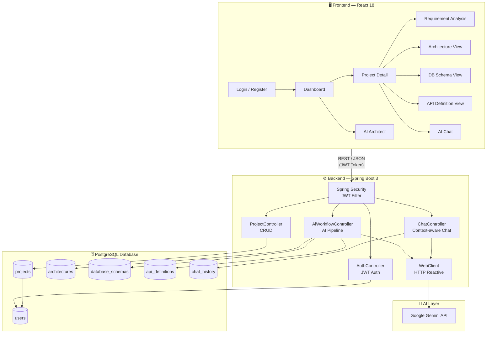

# SystemCraft AI 🚀

> **AI-powered software architecture & planning assistant** — Transform a plain English requirement into a complete system blueprint: architecture, database schema, API definitions, and an interactive AI chat — all in one workflow.

---

## 🏗️ System Architecture



---

## ✨ Core Features

| Feature | Description |
|---|---|
| 🔐 **JWT Authentication** | Secure register/login with role-based access and stateless JWT tokens |
| 📋 **Project Management** | Create and manage multiple software projects with full CRUD support |
| 🧠 **AI Requirement Analysis** | Automatically generates features, entities, and constraints from plain text |
| 🏛️ **Architecture Generation** | AI suggests Monolith vs Microservices with trade-offs and tech stack |
| 🗄️ **Database Schema Generator** | Produces normalized table structures, relationships, and raw SQL |
| 📡 **API Definition Generator** | Generates REST endpoint definitions with method, path, request/response bodies |
| 💬 **Context-aware AI Chat** | Refine requirements with a project-scoped AI assistant with full chat history |
| 🖥️ **Monaco Editor Preview** | View and inspect generated schemas and API definitions in a code editor |

---

## 🛠️ Tech Stack

### Frontend
| Technology | Role |
|---|---|
| React 18 | UI Framework |
| Zustand | Global State Management |
| Monaco Editor | Code Preview Panel |
| React Router | Client-side Routing |
| Vanilla CSS (Glassmorphism) | Styling & Animations |

### Backend
| Technology | Role |
|---|---|
| Spring Boot 3 | Application Framework |
| Spring Security + JWT | Authentication & Authorization |
| Spring Data JPA | ORM & Database Access |
| WebClient (Reactor) | Reactive AI API Integration |
| Maven | Build Tool |

### Infrastructure
| Technology | Role |
|---|---|
| PostgreSQL | Relational Database |
| Google Gemini API | AI Language Model |
| Java 17 | Runtime |

---

## 🗄️ Database Schema

```
users ──────────── projects ─────────┬── architectures
                                      ├── database_schemas
                                      ├── api_definitions
                                      └── chat_history
```

Six normalized tables with foreign-key relationships. The full DDL is at [`database/schema.sql`](./database/schema.sql).

---

## 🔌 API Overview

| Controller | Endpoints | Purpose |
|---|---|---|
| `AuthController` | `POST /api/auth/register`, `POST /api/auth/login` | User registration & JWT login |
| `ProjectController` | `GET/POST/DELETE /api/projects/**` | Project CRUD |
| `AiWorkflowController` | `POST /api/ai/**` | AI pipeline (analysis, arch, schema, api) |
| `ChatController` | `POST /api/chat`, `GET /api/chat/{projectId}` | AI Chat with history |

---

## 🚀 Getting Started

### Prerequisites
- Java 17+
- Node.js 18+
- Maven 3.9+
- PostgreSQL 14+
- Google Gemini API Key

### 1️⃣ Database Setup
```sql
-- Run the schema script against your PostgreSQL instance
psql -U <user> -d <database> -f database/schema.sql
```

### 2️⃣ Backend Setup
```bash
# Navigate to the server directory
cd Server

# Configure credentials in:
# src/main/resources/application.properties
#   spring.datasource.url=jdbc:postgresql://localhost:5432/<db>
#   spring.datasource.username=<user>
#   spring.datasource.password=<password>
#   google.ai.api.key=<YOUR_GEMINI_API_KEY>

# Run the application
mvn spring-boot:run
```
> Backend starts on `http://localhost:8080`

### 3️⃣ Frontend Setup
```bash
# Navigate to the client directory
cd Client

# Install dependencies
npm install

# Start the dev server
npm run dev
```
> Frontend starts on `http://localhost:3000`

---

## 📁 Project Structure

```
SystemCraft-AI/
├── Client/                      # React 18 Frontend
│   └── src/
│       ├── pages/               # Login, Register, Dashboard, ProjectDetail, AiArchitect
│       ├── components/          # Reusable UI components (AI panels, chat, etc.)
│       ├── services/            # Axios API service layer
│       ├── store/               # Zustand global state
│       └── styles/              # Global CSS and theme tokens
│
├── Server/                      # Spring Boot 3 Backend
│   └── src/main/java/com/systemcraft/ai/
│       ├── controller/          # REST controllers (Auth, Project, AI, Chat)
│       ├── service/             # Business logic layer
│       ├── entity/              # JPA entities (Users, Projects, etc.)
│       ├── repository/          # Spring Data JPA repositories
│       ├── dto/                 # Request / Response DTOs
│       ├── ai/                  # AI integration & prompt builders
│       └── security/            # JWT filter, security config
│
└── database/
    └── schema.sql               # PostgreSQL DDL
```

---

## 🔐 Security

- Passwords are hashed using **BCrypt** before storage.
- All protected endpoints require a valid **Bearer JWT token** in the `Authorization` header.
- Stateless session management — no server-side session state.

---

## 🎯 Design Principles

- **Clean Architecture** — Business logic is fully decoupled from controllers and persistence layers.
- **SOLID Principles** — Single responsibility enforced across services and repositories.
- **Reactive AI calls** — Non-blocking HTTP via Spring WebClient for Gemini API calls.
- **Glassmorphism UI** — Premium frosted-glass design system with micro-animations.

---

## 📄 License

This project is licensed under the **MIT License** — see [LICENSE](./LICENSE) for details.

